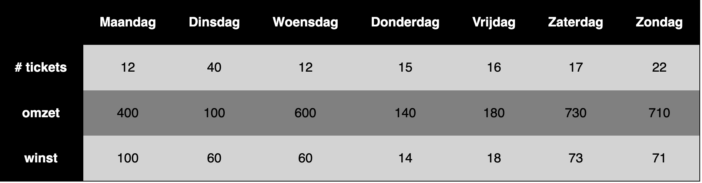

Bouw de gegeven tabel in HTML en CSS. Zorg ervoor dat de koppen van de tabel de dagen aangeven en dat de rijen de informatie over de producten en inkomsten bevatten. De eerste kolom bevat eveneens een legende van de rij.

Gebruik hierbij het `<th>`-element voor de koppen en het `<td>`-element voor de data. Geef elke `<th>` een `scope`-attribuut: `scope="col"` voor de dagen bovenaan en `scope="row"` voor de legende in de eerste kolom. Geef de even rijen een andere achtergrond kleur dan de oneven (lightgray / gray) en zorg voor voldoende padding.

## Verwacht resultaat

